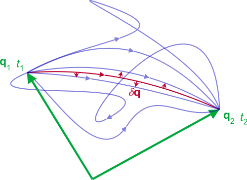

# NN_stationary_action
NN for the classical mechanics

The stationary-action principle – also known as the principle of least action – is a variational principle that, when applied to the action of a mechanical system, yields the equations of motion for that system. The principle states that the trajectories (i.e. the solutions of the equations of motion) are stationary points of the system's action functional.

$\mathbf{q} : \mathbf{R} \to \mathbf{R}^N$

$\mathcal{S}[\mathbf{q}, t_1, t_2] = \int_{t_1}^{t_2} L(\mathbf{q}(t),\mathbf{\dot{q}}(t), t) dt $ 

This neural network learns to build trajectories between two points. The Lagrange-Euler equations were used as the loss function.
